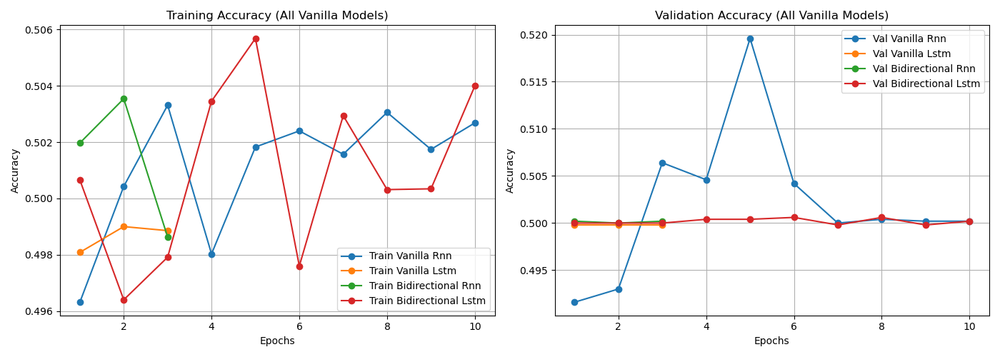
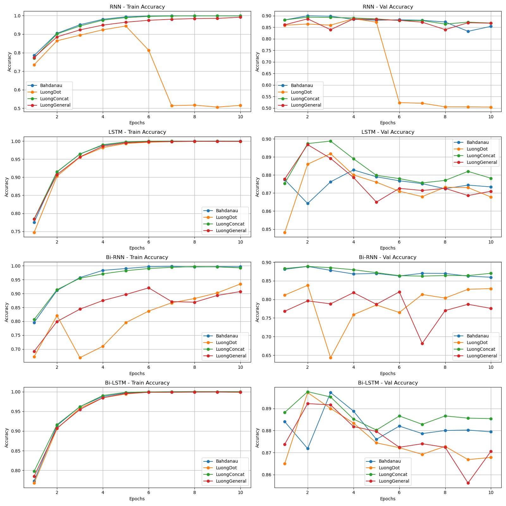
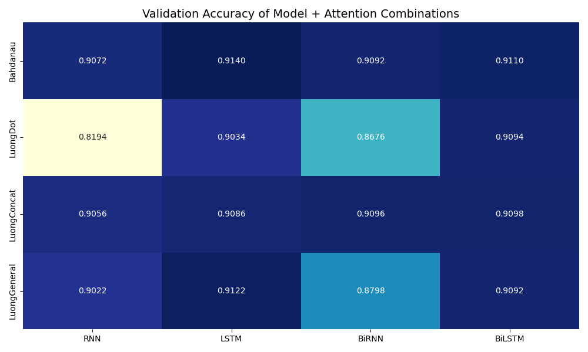
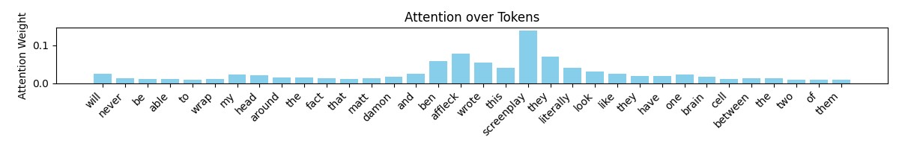

# Sentiment Analysis with Attention Mechanisms

Binary sentiment classification on the [Stanford IMDB dataset](https://huggingface.co/datasets/stanfordnlp/imdb) using LSTM-based models augmented with various attention mechanisms.

🌐 **Live Demo:** [sentiment-analysis-livid-eta.vercel.app](https://sentiment-analysis-livid-eta.vercel.app/)

---

## Overview

This project explores how different **attention mechanisms** (Bahdanau, Luong Dot, Luong Concat, Luong General) interact with different **sequence models** (Vanilla RNN, Vanilla LSTM, Bidirectional RNN, Bidirectional LSTM) for sentiment classification. The best-performing models are served via **SentiScope** — a React web app backed by a FastAPI + ONNX Runtime inference server — that visualises attention weights over input tokens in real time.

---

## Dataset

- **Source:** [Stanford IMDB](https://huggingface.co/datasets/stanfordnlp/imdb) via HuggingFace
- **Size:** 50,000 labelled reviews (25k train + 25k test), binary labels (positive / negative)
- **Split:** Combined and re-split into **70 % train / 10 % val / 20 % test** with stratification
- **Preprocessing:**
  - Lowercasing, HTML tag removal, punctuation stripping, whitespace normalisation
  - Vocabulary built from train + test texts (min frequency ≥ 2); special tokens `<PAD>` and `<UNK>`
- **Embeddings:** **GloVe 100-d** (`glove.6B.100d.txt`) — weights initialised from pre-trained vectors and kept trainable during fine-tuning

---

## Models

All models share the same embedding layer (GloVe 100-d, trainable) and a 0.3 dropout layer applied to sequence outputs.

| Model | Architecture |
|---|---|
| **Vanilla RNN** | Single-direction RNN, hidden size 100 |
| **Vanilla LSTM** | Single-direction LSTM, hidden size 100 |
| **Bidirectional RNN** | BiRNN, hidden size 100 per direction |
| **Bidirectional LSTM** | BiLSTM, hidden size 100 per direction |

**With attention**, the final classifier receives `[context_vector ; hidden_state]` instead of just `hidden_state`, doubling (or quadrupling for Bi-models) the input dimensionality to the fully-connected head.

---

## Attention Mechanisms

Four attention variants were implemented and compared:

### Bahdanau (Additive) Attention
Projects encoder outputs \(W_{\text{enc}}\) and decoder hidden state \(W_{\text{dec}}\) into a shared attention space, then computes attention scores using a learned vector \(v\):

\[
e_i = v^\top \tanh\!\left(W_{\text{enc}} h_i + W_{\text{dec}} s_t\right)
\]

\[
\alpha_i = \frac{\exp(e_i)}{\sum_j \exp(e_j)}
\]

\[
c_t = \sum_i \alpha_i h_i
\]

### Luong Dot Attention
Computes attention scores using the dot product between the decoder hidden state and each encoder output (requires equal dimensionality):

\[
e_i = h_i^\top s_t
\]

### Luong General Attention
Introduces a learnable weight matrix \(W\) before computing the dot product:

\[
e_i = h_i^\top W s_t
\]

### Luong Concat Attention
Concatenates the encoder and decoder states, applies a non-linear transformation, and scores using a learned vector \(v\):

\[
e_i = v^\top \tanh\!\left(W [\, s_t ; h_i \,]\right)
\]

## Training

| Hyperparameter | Value |
|---|---|
| Optimizer | Adam |
| Learning rate | 1e-2 |
| Loss | Cross-Entropy |
| Batch size | 64 |
| Max epochs | 10 |
| Early stopping | patience = 3 (on val loss) |
| Hidden size | 64 (fine-tuned models) |
| Attention dim | 32 |

The best checkpoint (highest validation accuracy) is saved to `models/`.

---

## Results

### Baseline — No Attention

All four models trained **without** attention, random-weight initialisation only (no GloVe):



 All vanilla (no-attention, no-GloVe) models hover near **50 % accuracy**, confirming that the gains below come from the combination of pre-trained embeddings and attention.

---

### Attention Comparison — All Model × Attention Combinations

Training and validation accuracy curves across all 16 model + attention combinations (4 architectures × 4 attention types):



---

### Validation Accuracy Heatmap

Best validation accuracy achieved by each model × attention combination:



Key observations:
- **LSTM + Bahdanau** achieves the highest single validation accuracy (**91.40 %**)
- **Luong Dot** performs poorly on RNN and BiRNN architectures (~82 % and ~87 % respectively), while performing comparably on LSTM architectures
- LSTM-family models are consistently more stable than RNN-family models

---

### Fine-tuned Model Test Metrics

The **Vanilla LSTM with Luong General** attention was selected as the final model and evaluated on the held-out test set:

| Metric | Value |
|---|---|
| Test Loss | 0.3315 |
| **Test Accuracy** | **89.85 %** |
| Test Precision | 0.8988 |
| Test Recall | 0.8985 |
| Test F1 Score | 0.8985 |

---

### Training Logs — Fine-tuned Models

| Model | Best Val Acc | Best Epoch |
|---|---|---|
| Vanilla LSTM + Bahdanau | 90.70 % | Epoch 4 |
| Vanilla LSTM + Luong General | **91.12 %** | Epoch 4 |
| BiLSTM + Bahdanau | 90.98 % | Epoch 3 |
| BiLSTM + Luong Concat | 90.62 % | Epoch 5 |

---

### Attention Weights Visualisation

Sample attention heatmap for a test review — the model highlights the words it found most informative when making its prediction:



The model correctly attends to semantically rich tokens (e.g. *screenplay*, *affleck*, *ben*) while suppressing function words.

---

## Sentiment Analysis Web App

**SentiScope** is a React + Vite frontend backed by a FastAPI inference server. It lets you:

1. **Select** any of the 4 trained model + attention combinations
2. **Type or paste** a movie review (or pick a sample)
3. **See** the predicted sentiment, confidence score (animated ring), and an **attention heatmap** showing which tokens the model focused on


## Deployment

The app is deployed using a two-service architecture:

| Service | Platform | URL |
|---|---|---|
| **Backend** (FastAPI + ONNX Runtime) | [Render.com](https://render.com) | [sentiment-analysis-9rab.onrender.com](https://sentiment-analysis-9rab.onrender.com) |
| **Frontend** (React + Vite) | [Vercel](https://vercel.com) | [sentiment-analysis-livid-eta.vercel.app](https://sentiment-analysis-livid-eta.vercel.app/) |


The trained PyTorch checkpoints were exported to ONNX format using `codes/export_onnx.py`. At inference time the server uses **ONNX Runtime** instead of Pytorch.


---

## Setup & Usage


Install inference dependencies:

```bash
pip install -r codes/requirements.txt
```

### Running the Training Notebook

Open `codes/main.ipynb` in Jupyter and run all cells sequentially. GloVe vectors (`glove.6B.100d.txt`) must be present in the `codes/` directory.

---

## References

- [Bahdanau et al., 2015 — Neural Machine Translation by Jointly Learning to Align and Translate](https://arxiv.org/abs/1409.0473)
- [Luong et al., 2015 — Effective Approaches to Attention-based Neural Machine Translation](https://arxiv.org/abs/1508.04025)
- [GloVe: Global Vectors for Word Representation](https://nlp.stanford.edu/projects/glove/)
- [Stanford IMDB Dataset](https://huggingface.co/datasets/stanfordnlp/imdb)
